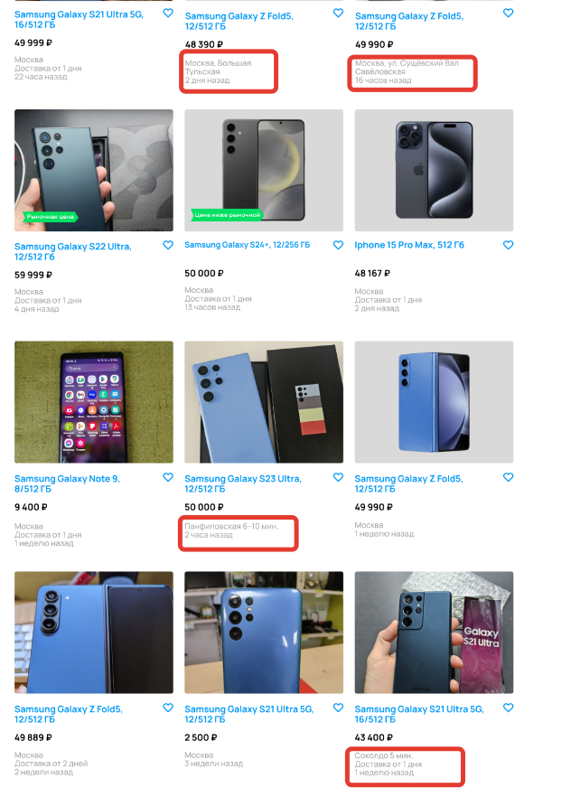

[Назад](../BUGS.md)

# Bug 10

### Отсутствует значок пешехода и не указано количество минут до метро, в карточках, где указано метро

### Шаги воспроизведения

1. Открыть сайт [Авито](https://www.avito.ru) 
2. Нажать на иконку Электроника  
3. Нажать на иконку Телефоны  
4. В поле Производитель ввести Samsung  
5. В фильтре Память выбрать 512 ГБ  
6. В фильтре Цвет выбрать синий  
7. В фильтре Цена в поле до ввести 50000     
8. Нажать кнопку "Показать..."    

### Ожидаемый результат
* Присутствует значок пешехода и указано количество минут до метро, в карточках, где указано метро   

### Фактический результат
* Отсутствует значок пешехода и не указано количество минут до метро, в карточках, где указано метро    

### Приоритет
* Low  

### Окружение
*  Desktop, дополнительная информация, с какого устройства сделан скриншот, отсутствует    
### Скриншот
     

### Примечание
*  Баг актуален в случае, когда в качестве макета и требований используется сайт [Авито](https://www.avito.ru)   