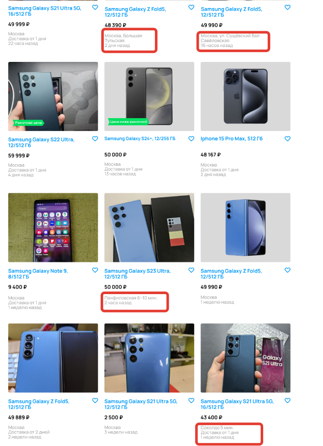

[Назад](../BUGS.md)

# Bug 12

### Отсутствуют кружки с цветом веток метро  

### Шаги воспроизведения

1. Открыть сайт [Авито](https://www.avito.ru) 
2. Нажать на иконку Электроника  
3. Нажать на иконку Телефоны  
4. В поле Производитель ввести Samsung  
5. В фильтре Память выбрать 512 ГБ  
6. В фильтре Цвет выбрать синий  
7. В фильтре Цена в поле до ввести 50000  
8. Нажать кнопку "Показать..."  
 
### Ожидаемый результат
* В карточке товара слева от указанного метро находится кружок цветом, соответствующей ветки

### Фактический результат
* Кружок отсутствует

### Приоритет
* Low  

### Окружение
*   Desktop, дополнительная информация, с какого устройства сделан скриншот, отсутствует    
### Скриншот
     
### Примечание
*  Баг актуален в случае, когда в качестве макета и требований используется сайт [Авито](https://www.avito.ru) 