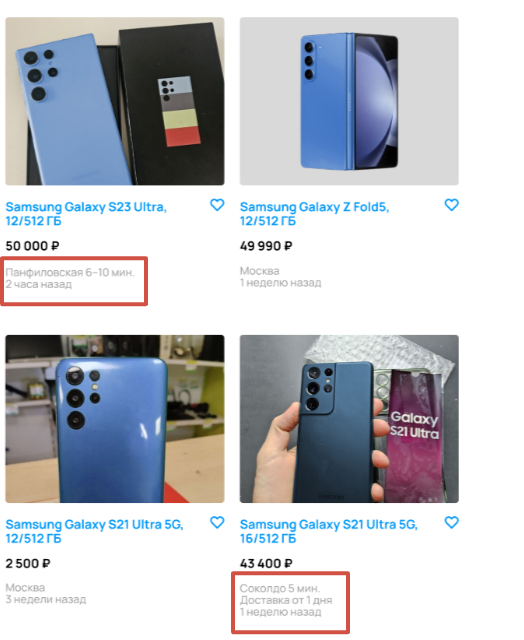

[Назад](../BUGS.md)

# Bug 13

### Отсутствует город в карточках, где указано метро

### Шаги воспроизведения

1. Открыть сайт https://www.avito.ru  
2. Нажать на иконку Электроника  
3. Нажать на иконку Телефоны  
4. В поле Производитель ввести Samsung  
5. В фильтре Память выбрать 512 ГБ  
6. В фильтре Цвет выбрать синий  
7. В фильтре Цена в поле до ввести 50000    
8. Нажать кнопку "Показать..."  
 

### Ожидаемый результат
* Во всех городах, где указано ближайшее метро, указан город Москва  

### Фактический результат
* Город указан не на всех карточках с указанным метро  

### Приоритет
* Low  

### Окружение
*   Desktop, дополнительная информация, с какого устройства сделан скриншот, отсутствует  
### Скриншот
   
### Примечание
