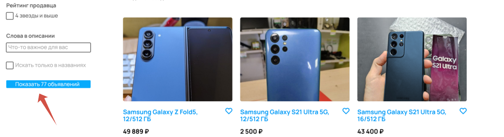

[Назад](../BUGS.md)

# Bug 16

### Количество объявлений на кнопке "Показать..." не соответствует количеству найденных товаров

### Шаги воспроизведения

1. Открыть сайт [Авито](https://www.avito.ru) 
2. Нажать на иконку Электроника  
3. Нажать на иконку Телефоны  
4. В поле Производитель ввести Samsung    
5. В фильтре Память выбрать 512 ГБ  
6. В фильтре Цвет выбрать синий  
7. В фильтре Цена в поле до ввести 50000    
8. Нажать кнопку "Показать..."  

### Ожидаемый результат
* На кнопке "Показать 120 тыс объявлений"  

### Фактический результат
* На кнопке "Показать 77 тыс объявлений"  

### Приоритет
* Low  

### Окружение
*   Desktop, дополнительная информация, с какого устройства сделан скриншот, отсутствует   
### Скриншот
      
      

### Примечание
*  Баг актуален в случае, когда фильтр применен (Так как на сайте [Авито](https://www.avito.ru) в случае, когда фильтры изменены, но сам фильтр не применен, количество объявлений на кнопке и найденных объявлений отличается)