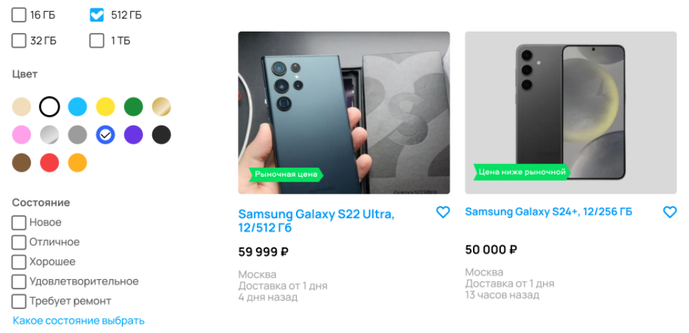

[Назад](../BUGS.md)

# Bug 17

### Ошибка в работе фильтра Цвет

### Шаги воспроизведения
1. Открыть сайт [Авито](https://www.avito.ru) 
2. Нажать на иконку Электроника  
3. Нажать на иконку Телефоны  
4. В поле Производитель ввести Samsung    
5. В фильтре Память выбрать 512 ГБ    
6. В фильтре Цвет выбрать синий   
7. В фильтре Цена в поле до ввести 50000    
8. Нажать кнопку "Показать..."   

### Ожидаемый результат
* На странице только карточки с Samsung только синего цвета  

### Фактический результат
* На странице есть карточки с Samsung не синего цвета  

### Приоритет
* Medium

### Окружение
*   Desktop, дополнительная информация, с какого устройства сделан скриншот, отсутствует   
### Скриншот
       

### Примечание
*  Баг актуален в случае, когда фильтр применен и при условии, что продавец верно указал цвет в карточке товара  