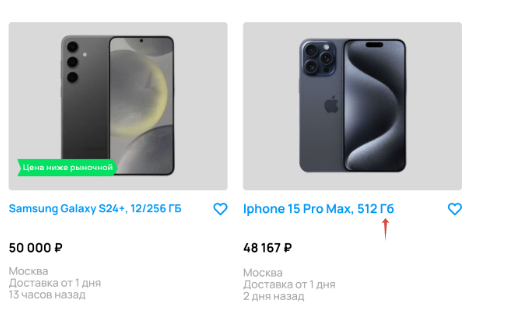

[Назад](../BUGS.md)

# Bug 20

### Неверное написание "Гб" в карточке товара Iphone Pro 15 Max

### Шаги воспроизведения

1. Открыть сайт [Авито](https://www.avito.ru) 
2. Нажать на иконку Электроника  
3. Нажать на иконку Телефоны  
4. В поле Производитель ввести Samsung  
5. В фильтре Память выбрать 512 ГБ    
6. В фильтре Цвет выбрать синий  
7. В фильтре Цена в поле до ввести 50000  
8. Нажать кнопку "Показать..."   

### Ожидаемый результат
* Единица измерения памяти "ГБ"    

### Фактический результат
* Единица измерения памяти "Гб"  

### Приоритет
* Low  

### Окружение
*   Desktop, дополнительная информация, с какого устройства сделан скриншот, отсутствует    

### Скриншот
    
 
### Примечание
