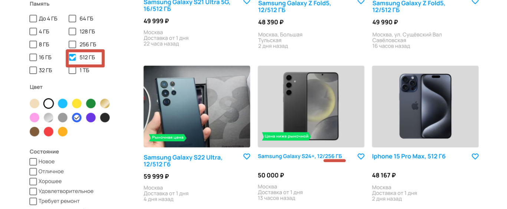

[Назад](../BUGS.md)

# Bug 9

### Ошибка в работе фильтра Память

### Шаги воспроизведения

1. Открыть сайт https://www.avito.ru  
2. Нажать на иконку Электроника  
3. Нажать на иконку Телефоны  
4. В поле Производитель ввести Samsung  
5. В фильтре Память выбрать 512 ГБ    
6. В фильтре Цвет выбрать синий  
7. В фильтре Цена в поле до ввести 50000  
8. Нажать кнопку "Показать..."  
### Ожидаемый результат
* На странице карточки только с памятью 512 ГБ  

### Фактический результат
* На странице есть карточка с памятью 256 ГБ  

### Приоритет
* Low  

### Окружение
*  Desktop, дополнительная информация, с какого устройства сделан скриншот, отсутствует   
### Скриншот
       

### Примечание