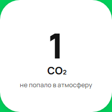

[Назад](../BUGS.md)  

# Bug 2

### Неверное значение в счетчике при CO₂ 1 триллион тонн

### Шаги воспроизведения 

1. Открыть сайт [Авито](https://www.avito.ru/avito-care/eco-impact)   
2. Создать имитацию ответа сервера на запрос https://www.avito.ru/web/1/charity/ecoImpact/init со значением CO₂ (поле co2) триллион тонн (1000000000000)

### Ожидаемый результат
*  Значение на счетчике при CO₂ 1 триллион тонн - "1 трл тонн"

### Фактический результат
* Значение на счетчике при CO₂ 1 триллион тонн  - "1 CO₂"

### Приоритет
* Low   

### Окружение
* Windows 11, Chromium-1112 

### Скриншот
    

### Примечание
