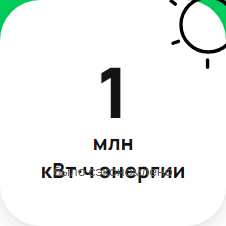

[Назад](../BUGS.md)  

# Bug 3

### Наслоение текста и неверные единицы измерения энергии при значении 1 млн кВт·ч 

### Шаги воспроизведения 

1. Открыть сайт [Авито](https://www.avito.ru/avito-care/eco-impact)   
2. Создать имитацию ответа сервера на запрос https://www.avito.ru/web/1/charity/ecoImpact/init со значением энергии (поле energy) 1 млн кВт·ч 

### Ожидаемый результат
* Значение на счетчике при энергии 1 миллионе кВт·ч  - "1 тыс МВт·ч"

### Фактический результат
* Значение на счетчике при энергии 1 миллионе кВт·ч  - "1 млн кВт·ч" и наслоение текста

### Приоритет
* Low   

### Окружение
* Windows 11, Chromium-1112 

 
### Скриншот
     
### Примечание
