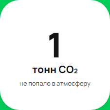

[Назад](../TESTCASES.md) 

# Test case 10

### Изменение единиц измерения CO₂ с кг при значении количества CO₂ 1001 кг 

### Предусловия
1. Открыть сайт [Авито](https://www.avito.ru/avito-care/eco-impact)  
2. Авторизоваться  [Инструкция](../autotests/README.md)  

### Шаги исполнения
1. Создать имитацию ответа сервера на запрос https://www.avito.ru/web/1/charity/ecoImpact/init со значением CO₂ (поле co2) 1001 

### Ожидаемый результат
* Единица измерения CO₂ - тонны, если значение 1001 кг  

### Фактический результат
* Единица измерения CO₂ - тонны, если значение 1001 кг  

### Окружение
* Windows 11, Chromium-1112   
  

### Скриншот
    

### Результат
* PASSED  

### Ссылка на баг-репорт

