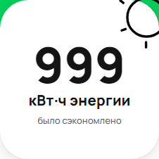

[Назад](../TESTCASES.md) 

# Test case 11

### Единицы измерения энергии при значении количества энергии 999 кВт·ч

### Предусловия

1. Открыть сайт: https://www.avito.ru/avito-care/eco-impact
2. Авторизация (инструкция для авторизации: ссылка)  

### Шаги исполнения

1. Создать имитацию ответа сервера на запрос https://www.avito.ru/web/1/charity/ecoImpact/init со значением энергии (поле energy) 999  

### Ожидаемый результат
* Единица измерения энергии при значении 999 - кВт·ч  

### Фактический результат
* Значение счетчика "999 кВт·ч"  

### Окружение
* Windows 11, Chromium-1112   

### Скриншот
    

### Результат
* PASSED  

### Ссылка на баг-репорт
* 
