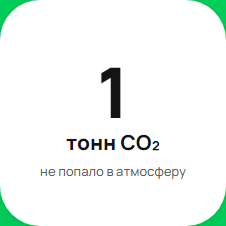

[Назад](../TESTCASES.md)

# Test case 13

### Слово тонна склоняется в соответствии с количеством воды в счетчике

### Предусловия
1. Открыть сайт [Авито](https://www.avito.ru/avito-care/eco-impact)  
2. Авторизоваться  [Инструкция](../autotests/README.md)  

### Шаги исполнения
1. Создать имитацию ответа сервера на запрос https://www.avito.ru/web/1/charity/ecoImpact/init со значением CO₂ (поле co2) 1000  
### Ожидаемый результат
* В счетчике количества воды "1 тонна"    

### Фактический результат
* В счетчике количества сохраненной воды "1 тонн"   

### Окружение
* Windows 11, Chromium-1112   

### Скриншот
     

### Результат
* FAILED  

### Ссылка на баг-репорт
* [BUG-1]((./bugs/BUG-1.md))
