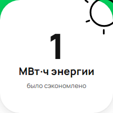

[Назад](../TESTCASES.md) 

# Test case 6

### Изменение единиц измерения энергии с кВт·ч на МВт·ч в счетчике при значении количества энергии 1000 кВт·ч
* 

### Предусловия

1. Открыть сайт: https://www.avito.ru/avito-care/eco-impact
2. Авторизация (инструкция для авторизации: ссылка)  

### Шаги исполнения

1. Создать имитацию ответа сервера на запрос https://www.avito.ru/web/1/charity/ecoImpact/init со значением энергии (поле energy) 1000

### Ожидаемый результат
* Единица измерения энергии в МВт·ч, если значение 1000 кВт·ч

### Фактический результат
* Единица измерения энергии в МВт·ч, если значение 1000 кВт·ч

### Окружение
* Windows 11, Chromium-1112 

### Скриншот
  

### Результат
* PASSED

### Ссылка на баг-репорт
* 
