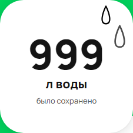

[Назад](../TESTCASES.md) 

# Test case 7

### Единицы измерения при значении количества воды 999 л

### Предусловия
1. Открыть сайт [Авито](https://www.avito.ru/avito-care/eco-impact)  
2. Авторизоваться  [Инструкция](../autotests/README.md)  

### Шаги исполнения
1. Создать имитацию ответа сервера на запрос https://www.avito.ru/web/1/charity/ecoImpact/init со значением воды (поле water) 999  

### Ожидаемый результат
* Единица измерения количества воды при значении - л

### Фактический результат
* Значение счетчика "999 л"

### Окружение
* Windows 11, Chromium-1112 
  
### Скриншот
  

### Результат
* PASSED

### Ссылка на баг-репорт

