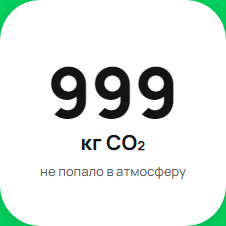

[Назад](../TESTCASES.md)

# Test case  9

### Единицы измерения CO₂  при значении количества CO₂ 999 кг

### Предусловия
1. Открыть сайт [Авито](https://www.avito.ru/avito-care/eco-impact)    
2. Авторизоваться  [Инструкция](../autotests/README.md)   

### Шаги исполнения
1. Создать имитацию ответа сервера на запрос https://www.avito.ru/web/1/charity/ecoImpact/init со значением CO₂ (поле co2) 999  

### Ожидаемый результат
* Значение счетчика "999 кг"  

### Фактический результат
*  Значение счетчика "999 кг"  

### Окружение
* Windows 11, Chromium-1112   
  

### Скриншот
    

### Результат
* PASSED  

### Ссылка на баг-репорт

